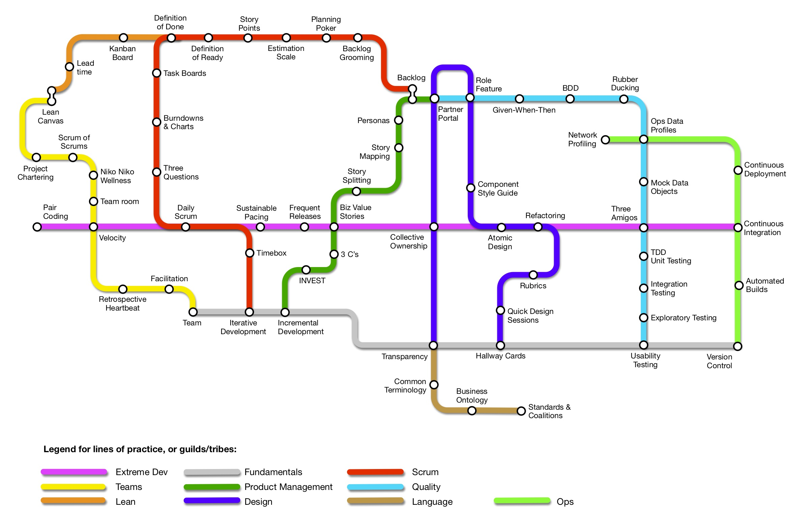

# Agile Practices Roadmap

Thoughts on working together, and supporting organizations.  Here is a growing collection of things that have come up regularly.  It is far from complete, even for what comes up regularly — but it's nice to write sometimes. 

As sections are currently all WIP, please reach out with thoughts.

## Practices

* [Docs](/docs-best-practices.md)
* [Wiki](wiki-best-practices.md)
* [Ticketing](ticketing-best-practices.md)
* [Anatomy of Web Apps](web-app-anatomy-best-practices.md)
* [Anatomy of CMS Apps](cms-anatomy-best-practices.md)
* [Anatomy of Email Systems](email-engagement-anatomy.md)
* [Data, Services and Pipelines](data-science.md)

### Agile Groups
* [QA and Testing](qa-test-framework.md)
* [QA for Event & Distributed Systems](qa-evented-framework.md)
* [Notification](notification-practices.md)
* [An Agile-practice framework (SAFE-like)](agile-planning-practices.md)

### Hiring
* [Interviewing](interviewing.md)
* [IP Agreements](ip-agreements.md)

### Business Systems
* [Meditations on Business Continuity](business-continuity.md)
* [Vendor Lifecycle steps](vendor-lifecycle.md)
* [Notes on Managing Partner Relations](partners-and-accounts.md)
* [Data Security Guidance](data-security.md)
* [Data Classification and Management](data-classification.md)
* [Anatomy of BI Systems](bi-anatomy-best-practices.md)
* [BC / DR Roadmap](business-continuity-disaster-recovery-roadmap.md)

### Teams
* [Onboarding and Ohana](onboarding.md)
* [Coach Near and Far](coaching-training.md)
* [The Structure of Data Science functions](data-science.md)
* [Distributed Teams & Remote Work](remote-work.md)

### Personal Style

* [Meetings](questions-and-answers/personal-inventory.md)

## The Roadmap

Not everything on here should ever be practiced at the same time.  Each route represents a course toward quality.  

## Contributing

* [Code of Conduct](CODE_OF_CONDUCT.md)
* [Contributing](CONTRIBUTING.md)

Thanks!

