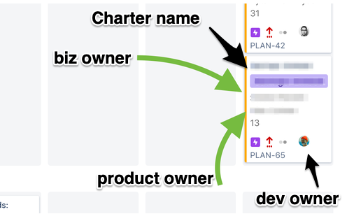
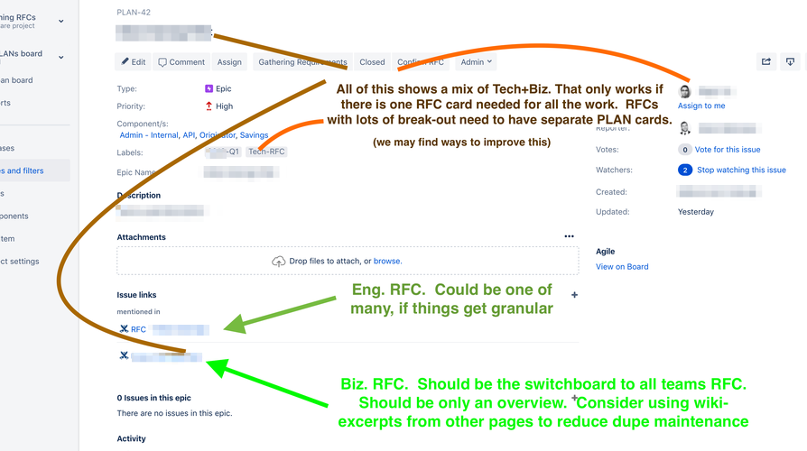

# Agile Configurations


### Step-by-step guides

💡_Thing not to do_

* skip steps out of inconvenience
* create new schemes without a prefix namespace
* leave default names like "Copy of ....."
* edit the statuses (they are global)
* edit the priorities (they are global)
* edit any Scheme or Issue Type that is in use by another project, without confirming with them.

## Implementation

Update the Planning epic in Jira to implement the workflow by doing the following:

* update the Planning State field to include the new states
* add any tasks for Charters that are not currently in the Planning project
* update tasks to have the correct state and assignee
* add a custom Charter text field to the Planning project, and populate with the appropriate links

The Planning boards should be linked in a common place.  Everyone should take responsibility for making sure that the work they own (feature / Charter / epic) stays up to date, along with ensuring that checkpoints are scheduled.

* All PLAN board in jira
* a board, e.g. Client Side Tracking
* search all issues with JQL


> Jira - See [Step-by-step guides](#Step-by-step-guides) board setup for epics and charters

#### Charter/epic planning board card


#### Charter / epic card fields



## PLAN board - New epic & Charter creation

This happens after approval to begin exploratory work, such as from the exec team. For Tech Charters, this happens once a Biz Charter has been completely prepped for triaging.  Eng. stakeholders have likely been involved or exposed during the Biz Charter stage(s).

1. create plan card
  1. add Components for product type, or service area
  1. add labels for targeted delivery quarter
  1. add labels for Charter type (biz, tech, launch)
  1. assign 3 people (unless unknown):
     * reporter: the Business person, probably from the biz Charter.
     * approver: the Product person guiding specs, QA, etc.
     * assignee: the engineer writing the tech Charter / leading it.
1. create Charter in wiki
  1. use your team's space. We recommend placing it under an 'All Charters' page.
  1. add labels to wiki page
  1. paste URL for PLAN card into wiki, creating a link
1. share the wiki link to draw discussion to there
  1. use this instead of slack / email when possible, to avoid needing to trasncribe
  1. select text on a wiki page, and comment inline
1. If there is a slack channel for this project, link the wiki page's slack notification to that channel.
  1. Consider setting the URL as the channel topic, or pinning, for convenience
1. If any cards are created on an epic, they have their project field set to the team that will work on them.
  1. multiple teams can collaborate on a single epic, this way.

### How to Read an Plan card (Charter)

### Charter Card Collaborators


## Jira board setup

This happens during the Backlog Build stage of the Charter

🚨 Do not use the normal 'create new board' GUI that Jira provides. Clone & rename a board, as below

1. Copy from existing team board Query / filter (option under row '…' button)
  1. Edit query (see example; right)
1. Copy from an existing Board (option under '…' button)
1. Change color-coding of cards to be based one something helpful
  1. located in the board's settings
1. Add URL for new board to the related epic (PLAN card)
  1. add the URL to the slack channel topic, too, maybe (smile)
1. optional
  1. Add components for each type.
  1. Bulk move types to components
  1. Bulk move all cards to epics
1. Add the new PLAN to the exclusion list of the project that hosts the board.  This is done in the filter for the project team backlog.

## Jira board removal when done

1. delete board
1. Delete board query
1. DO NOT DELETE epics or cards
1. Move Charter wiki page to be a child of Archived page
  1. add a label for archived
  1. this is all located in the team's Charter section, e.g. Eng. All Charters
1. Update the filter for the project team backlog; remove the PLAN from the exclusion.

## Example backlog board query

This example covers the range of board configs we use today:

1. includes and epic from the PLAN board in the backlog of work
1. targets the Project,
1. excludes epics that have their own board for this team,
1. excludes components that have their own board for this team
1. excludes things that are done (does not rely on `release` / `fixVersion`)
1. orders the cards by force-rank (manual dragging)

```
KEY in (PLAN-47) or (
  project = PLAT
  AND ("Epic Link" not in (PLAN-1) or "Epic Link" is EMPTY)
  AND component not in (Emails)
  AND (
    status not in (done, Closed, Completed)
    OR (status in (done, Closed, Completed)
    AND updated >= 1d)
  )
) ORDER BY Rank ASC
```
