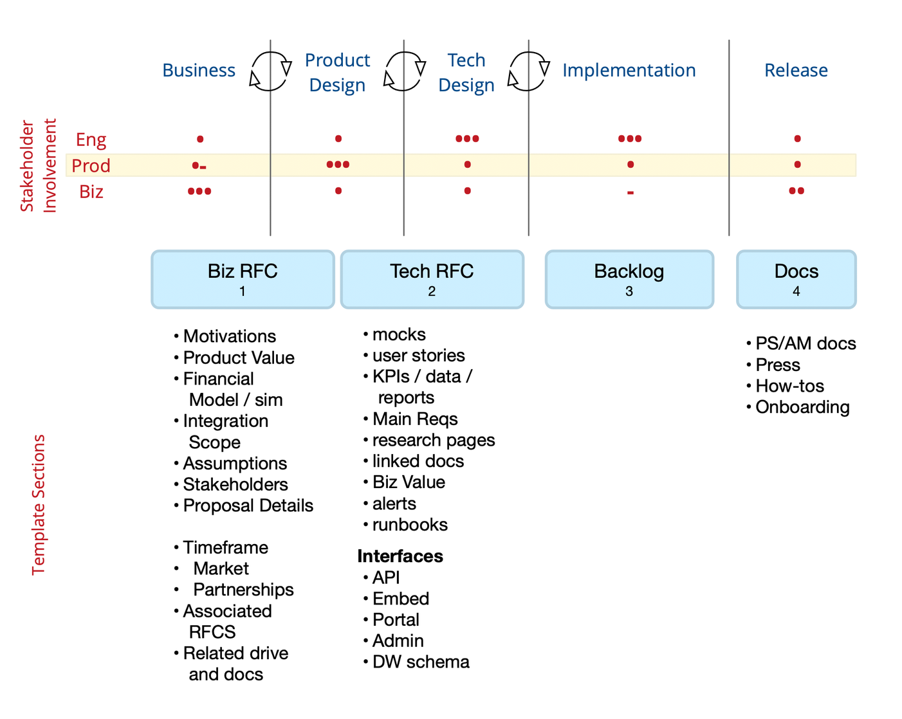
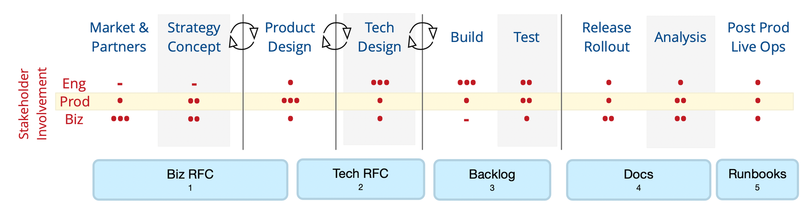

# Chartering

I like to aim for a lightweight workflow for master planning documents (Charters / Charters / etc) as they move from an idea until they're ready to be implemented. Usually this process is managed in an ad hoc fashion, and as a result often lacks visibility and consistency.

### Issues:

* incomplete view of medium term priorities
* some potential Charters lose momentum
* in progress Charters are reviewed inconsistently

### Goal:

* complete visibility into all planning and design work
* consistent process and cadence moving from gathering requirements to completed Charter

### Non Goal:

* define the actual process of writing a Charter
* define the contents of a Charter

### Principles

Most of these will have already been implemented.  For more, [see the section on teams and meetings](/remote-work.html#meetings)

* Broadly source input
* Build consensus and education around approaches
* Execute with focus and accountability
* Measure what worked and what didn’t to iteratively improve

## Background

The idea of reviewing and leaving comments on a completed Charter is well-established in the tech organization, and the subsequent epic process is mostly standardized. However the process of actually developing a Charter has largely been left as exercise for the reader. This worked fine when the vast majority of the work on Charters was done by 2-3 people, but as the Engineering and Product teams grow, we need some process to better coordinate everyone involved.

As well, the Charter process in Engineering generally occurs after some Business planning.  Afterward, a release or launch planification helps the company own the success.  These major stages needed a place in the big picture.  Here we'll proposes to outline and detail all of that, in a way that can translate to input from stakeholders org-wide.

# Stages of Planning, Delivery, and Operationalization

## Product and Engineering

The concise chartering process focuses on Product planning, Engineering, and Release:

## Whole-Company

[Charter Types](agile-charter-types.md) stand as the granular versions of broader phases of work that go on within *the whole lifecycle of corporate planning*.  These phases can overlap.  The current consideration of these looks like this:

### Glossary

* A dash '-' is minimal involvement, such as gut-checks about scope changes, etc.
* Release and Rollout is sometime called Launch
* Analysis can include monitoring existing data, or developing new reports or monitors.  This should be prepared in advance of the release.
* Live Ops can involve new. response. and messaging templates, whole-team quality, revenue operations ('revops'), and FAQs.    These often get recorded into 'runbooks' that give guidance when situations occur.

[For detailed handling of configuring systems to hold all of these practices](agile-configurations.md), you should maintain docs on how to repeatably do setups.  Eventually, these can be automated.

## Checkpoints

Every Charter should have the following checkpoints:

### Requirements Review
The stakeholders must agree on the requirements once they are gathered. If they do, product and engineering should agree about how to proceed with writing the Charter and schedule incremental check ins. If they cannot agree, the requirements must be reworked.

### Incremental Charter Check In

The product and technical designs should be informed by each other and should be iterative, so check ins among the people working on producing the Charter are really important. They're also a good way to keep momentum.

### Final Review

Once the Charter is complete, all stakeholders must agree on the scope of work. Ideally stakeholders should be involved in prior checkpoints so there aren't any huge surprises at this point.

Stakeholders vary depending on the type of Charter. The stakeholders for a product Charter would include a product manager, the lead engineer and a business sponsor. For an eng Charter, the stakeholders might be a group of engineers.

For eng Charters, the tasks handled by a product manager would be either handled by the lead engineer (e.g., gathering requirements) or skipped (e.g., producing a product design).

# Agile Ritual

I find that much of the literature on Agile practices involves [the use of euphemistic phrases](https://www.linkedin.com/pulse/how-scrum-patterns-help-you-become-better-master-karel-smutn%C3%BD-1e/).  You may have seen these in examples like 'pop the happy-bubble', etc.  It appears that all of these are rooted in [the narrative process of mind.](https://en.wikipedia.org/wiki/Bicameralism_(psychology))  Examples of pattern languages underscore this, such as for 

* [Product Organizations](assets/Scrum-Patterns-Organization.pdf)
* [Value Streams](assets/Scrum-Patterns-Value-Stream.pdf)

The theoretical roots of this extend from the concept of [Literary Topos](https://en.wikipedia.org/wiki/Literary_topos), which are akin to Jung's archetypes but potentially set in a more rich semantic ecosystem.  Literary Topos may be the granule of character archetypes, in the sense of Joseph Campbell's work.

Such narrative topoi certainly evolve with the changes of culture, at the macro level and within professions.  When used skillfully they should lubricate the system of communication.  In contrast, when the macro-org is dysfunctional, a narrative topos will be experienced more like _trope_, and often create the opposite effect. 

