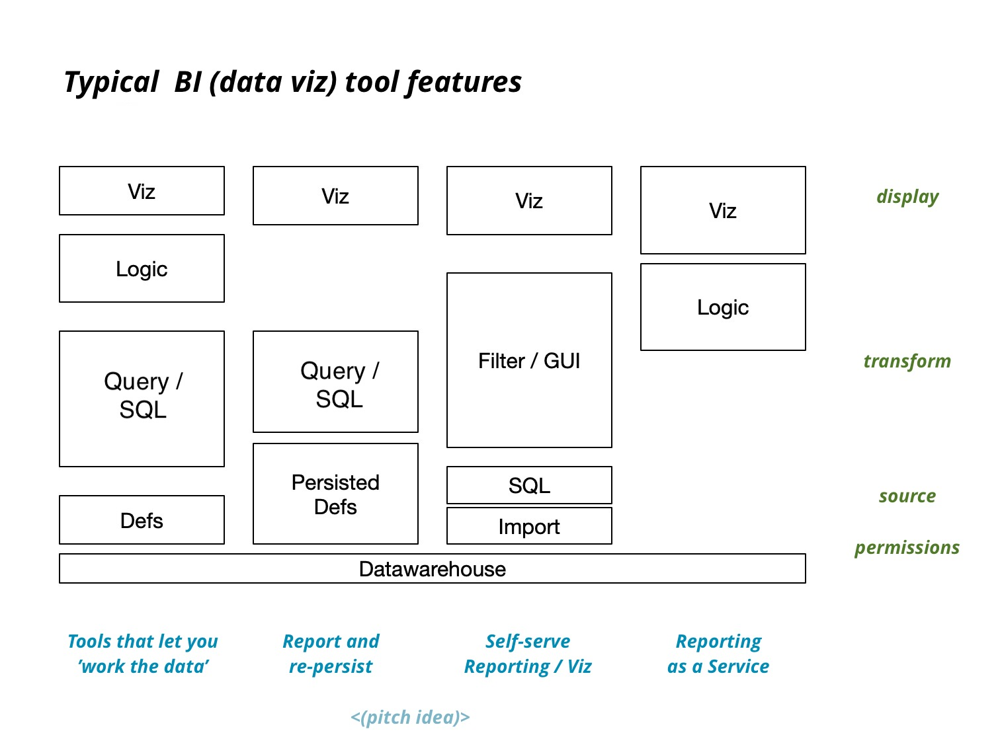

# Anatomy of BI Stacks

* Databases & data stores (app ingest)
* Integration sources
* Data warehouse
* [ETL & Data Processing piplines](data-science.md)
* Data Models
* Querying
* Regular Reporting
* Exploratory Reporting
* Vizualization
* Access Management
* Embedding / White-labeling

