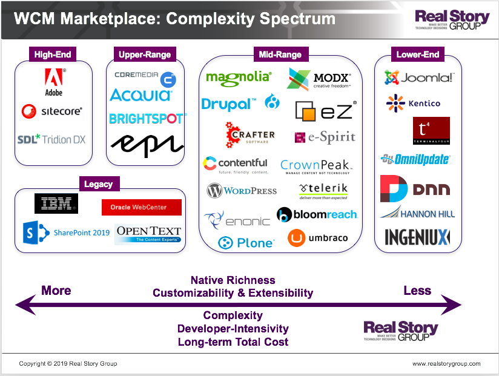

# Anatomy of CMS stacks

### On DAM and CMS variants

The lists below will present an aggregate of content functions across all the adjunct terrain.  It may help to remember that DAM (data access management) and CMS (content management) systems can sometimes have a niche focus on specific subsets. 

* DAMs often focus more on storage, versioning, retrieval, and metadata.  
* CMSs often focus more on editing, workflow and approvals, publishing, and sub-document metadatas.

## Editorial Requirements
* Content Revisions
* Content Revision Diffs
* "Simple Workflow 
* (publish/unpublish)"
* "Advanced Workflow 
* (Configurable states and rules)"
* Scheduled Publishing
* Costing for editorial workflow
* Custom Field Search
* Mass Actions
* "Content Authoring 
* Events/Webhooks"
* MetaData admin
* Autosave
* "Plagiarism Checking 
* (Ithenticate)"
* User Roles/Permissions
* Media Library
* "Content grouping and curation 
* (content listing)"
* Writer Collaboration
* WYSIWYG

## Technical Requirements
* Headless Support
* GraphQL
* REST
* Version Controlled Configuration
* Dockerizeable
* CLI
* Upgradeability
* Non-article content (eg product records)
* Custom settings administration
* Multi-Region (Localization)
* Query Performance - TODO: specify metrics or alternative
* API for integrations
  * Metadata labeling services
  * Reference to source-of-truth records

## 3rd Party Service Requirements
* S3
* LDAP
* TFA
* SSO

## General Information
* License
* Git Hub Stars
* Platform
* Age
* Trending
* Number of Modules
* Commercial Support
* Price
* Clients

# References
* [Two decades of CMSs](https://www.linkedin.com/pulse/two-decades-web-content-management-technology-tony-byrne/)
* https://docs.google.com/spreadsheets/d/1Tf7m7_y245-YZ9RAQZ-Pg6jkokqR32KnFx3jHIb_0es/edit#gid=925676804

