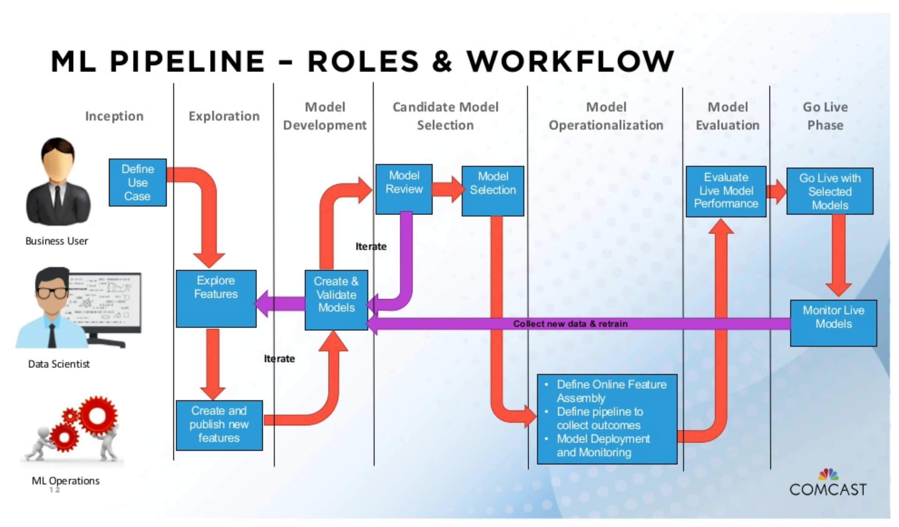

# The Structure of Corporate Data Science

For now, this is quick list of operational practices and skills that relate to data team and data science. 

## Team Structures
### Data Ops / Engineering
* Pipelines
* ETL
* Integrations
* Resourcing / hardware
* DBA (data store admin)

### Business Analyst
* Data Dictionaries
* Semantics / Schema
* Reporting, Live
* Reporting, Ad-hoc
* Visualization

### Data Science
* Model Development
* Ad-hoc models
* Validation
* Forecasting
* ML / AI, special cases
* Exploratory Research

## Data Flow Stages

* Source
* Identify
* OCR
* Triplify
* Validate
* Count
* Validate Uniqueness
* Dedup
* Mint
* Mask
* Transform
* NLP
* Trend
* Enrich (e.g. tag)
* Assess Quality
* Assess Provenance
* Route
* Split
* Join
* Sink

### Layers

Sometimes you will see any of these service or pipeline concepts organized into Physical, Logical, Integration, and Application layers.

## Data Services

* Linked Data
* Model Store
* Semantic Search
* µService Catalog
* Transactional
* Audit
* Logging
* Streaming
* Entitlements
* Data Quality
* Data Integrity (e.g. blockchain)
* Data Warehouse
* Content Graph
* Contract
* Business Architecture
* Organization
* Semantic Gap Analysis
* Semantic Link Association Prediction (SLAP)
* Visualization

## Workflows

### Models in the Data Pipeline

### Roles and Productionalizing Models

