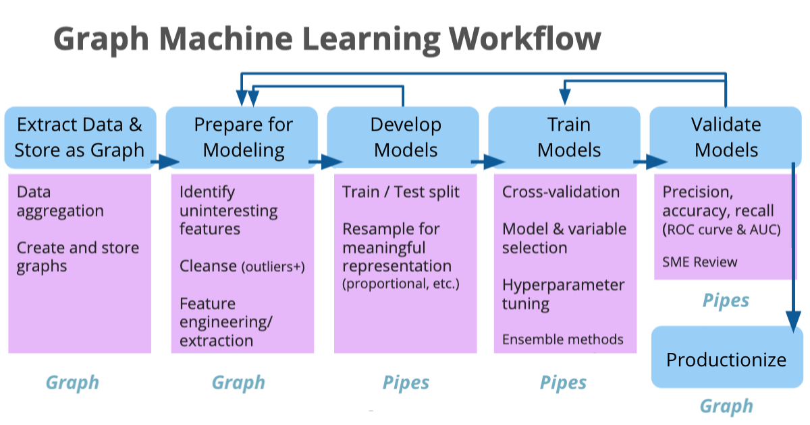

# The Structure of Corporate Data Science

For now, this is quick list of operational practices and skills that relate to data team and data science. 

## Team Structures
### Data Ops / Engineering
* Pipelines
* ETL
* Integrations
* Resourcing / hardware
* DBA (data store admin)

### Business Analyst
* Data Dictionaries
* Semantics / Schema
* Reporting, Live
* Reporting, Ad-hoc
* Visualization

### Data Science
* Model Development
* Ad-hoc models
* Validation
* Forecasting
* ML / AI, special cases
* Exploratory Research

## Data Flow Stages

* Source
* Identify
* OCR
* Triplify
* Validate
* Count
* Validate Uniqueness
* Dedup
* Mint
* Mask
* Transform
* NLP
* Trend
* Enrich (e.g. tag)
* Assess Quality
* Assess Provenance
* Route
* Split
* Join
* Sink

### Layers

Sometimes you will see any of these service or pipeline concepts organized into Physical, Logical, Integration, and Application layers.   [Observability](/data-classification.html#data-observability) becomes implicit in this, as well.

## Data Services

* Linked Data
* Model Store
* Semantic Search
* µService Catalog
* Transactional
* Audit
* Logging
* Streaming
* Entitlements
* Data Quality
* Data Integrity (e.g. blockchain)
* Data Warehouse
* Content Graph
* Contract
* Business Architecture
* Organization
* Semantic Gap Analysis
* Semantic Link Association Prediction (SLAP)
* Visualization

📖 If you're looking for hands-on examples, I recommend [Andreas Kertz's cookbook for data pipeline processes](https://github.com/andkret/Cookbook/blob/master/Data%20Engineering%20Cookbook.pdf).

## Workflows

* Continuous and extensible data processing
* The elasticity and agility of the cloud
* Isolated and independent resources for data processing
* Democratized data access and self-service management
* High availability and disaster recovery

### Models in the Data Pipeline

### Roles and Productionalizing Models

# CDPs and DMPs

Though these kinds of services / platforms are outside the scope of data science, generally, any company that have a robust relationship to data will touch these topics.

## Customer Data Platform

Several core concepts to a CDP include

* Single Source of Truth
* Advertising
* Personalization (p13n)
* Integration
* Tag / label management
* Event transformation
* Campaign integration and management
* Persona formation
* Customization of algorithms

## Data Management Platform

DMPs are primarily for enrichment of data.  Commonly, your own data is referred to as '1st party' data, and the enriched data can be '2nd party' or '3rd party'.  2nd party data is the 1st party data of another company.  3rd party data has been aggregated from the network and other sources.  

Sometimes, fusions and ML extrapolations can be considered part of a company's '1st party' data, but this should be validated and agreed upon by all partners.  The tolerance for certainty is a critical factor in downstream use, or design of experiments.

* Static Segments
* Adaptive Segments
* Cohort and Lookalike
* Interest Discovery

## FOSS Tools

* https://www.datatron.com/