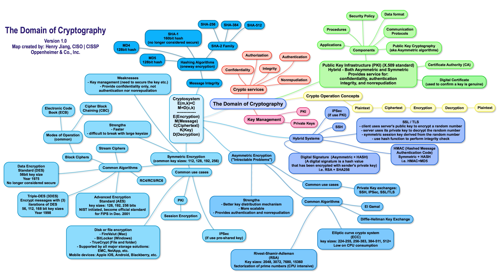

# Data Security

## Local Encryption, and Sharing

I commonly decide to use Keybase Teams because of the  need for a BYOK solution to securely sharing critical data, which could be expired, and was [TOFU-safe](https://keybase.io/blog/chat-apps-softer-than-tofu).

1. BYOK ensured that we could rotate keys, and be in control of those keys rather than delegating them to a service to hold the masters. 
1. Expiry was important, because we needed messages with certain risky information to disappear, to ensure against hacking (even despite our procedures). 
1. TOFU means 'trust on first use' and is reflected int he way that information is inaccessible to a use if they needed to do anything that interrupts the ability to trust their account — such a password reset.  

These together allowed us to use this tool within our data security chain.

## Encryption Methods

