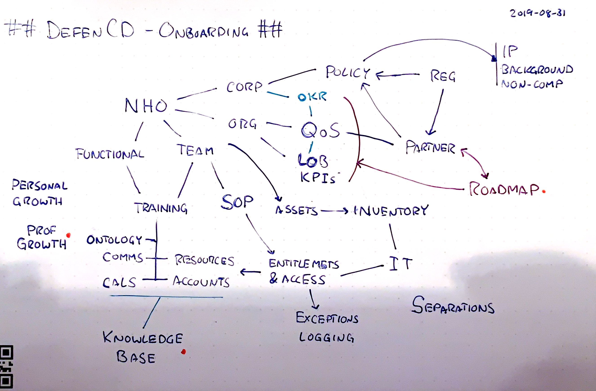

# Governance as a Service framework

## Onboarding

* NHO
  * Corp
  * Org
  * Team
  * Functional
* Training
  * Knowledge Base
     * Glossary / Ontology
     * contrib
  * Comms
  * Resources
  * Calendars
  * Accounts 
* IT
  * Assets Inventory
  * Entitlements auditing
  * Access permissions
  * Exceptions Logging
  * Separations
* Growth
  * Personal 
  * Professional
* Roadmapping
  * QoS Center
  * LOB KPIs
  * OKRs
* Partners
* Policy
  * Regulatory
  * Background checks, IP, non-compete

## Business Continuity Policy Alignment

* Policy §s
  * Types / ‘classes’
  * Risk Models
* Contracts
  * Partners
  * Vendors
  * Internal Apps
* SOPs & Workflows
  * Notifications
  * Configs
  * Apps
  * IAM
* Logs
* SLAs

## Audit Readiness

* Practice Guidance
  * Partners
  * Auditors
* Policy
  * Docs
  * Audit Frameworks
  * Certifications
* SOPs
  * Practices
  * Runbooks
  * Attestations
* Logs
  * Proofs

## Vendor Management

* Vendors
  * Cost structure
  * Management Time
  * Fungibility
* Contracts
* Risk
  * Types
  * Audits
  * Modeling
  * Scoring
* LOBs
  * Processes
  * Data
     * PII
     * Partner
     * Access

## Data Governance & Classification

* Sources
  * Format
     * Structured
     * Unstructured
  * Interface
     * Files
     * APIs
     * DBs
* Policy
  * Archive
  * Manage-in-place
  * Lifecycle management
* Indexing
  * Ontology
     * Vendors
     * Partners
     * Projects
     * Assets
     * Incident functionals
  * Classifiers
     * Content Classification
     * Context Classification
     * Training Data
  * Workflows
     * Actions
     * Logging
     * ML Automation
* Federated Search
  * Knowledge Base
  * ACLs

## Incident Response

* Data Sourcing
  * Service Runtime
  * Ops
  * Strategy
* Monitoring
  * QoS Center
* SLAs
  * Policy
  * Contracts & LOBs
  * Triggers
     * Failover
     * Runbooks
     * Fast Notification
     * Tickets
     * Status API
* Account Management
  * Email templates
* War Room
  * Comms
  * Teams
  * Tickets
     * Escalation
  * Analyses
     * Post Mortem
  * Change Management
  * Incident TImeline
* Knowledge Base

## Business Impact Analysis

* Readiness Frameworks (op int)
  * Responsiveness Exercises
     * Incident Types
     * Supply Chain
         * Cyber
         * Partner
     * Human Resource
         * Malpractice
         * Availability
     * Finance
  * Functional Areas
  * LOBs
  * Partners
* Trend Analysis Frameworks (strat int)
  * Market Segments
     * Cohorts
  * Activity Detection
     * Sourcing
     * Patents
     * Pubs
     * Startups
     * Hiring
     * Vertical
     * Search
     * Reviews
     * News
     * Social
     * Music
     * Semantics
     * Active
     * Emerging
     * Market Timeline
* Risk Models
  * Vendors
  * Supply Chain
  * Talent
  * Hedging & Insurance
  * Finance
  * Counterparty Credit
* Policy

