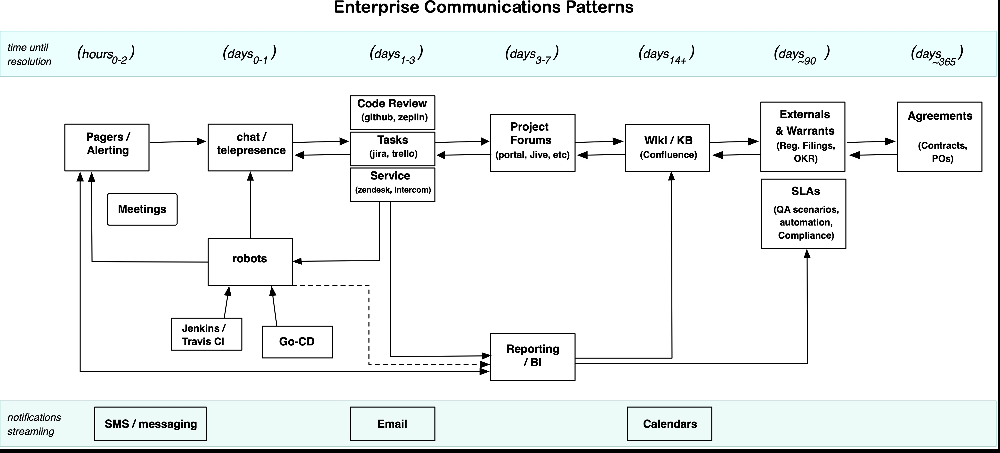

# Notifications

Notification are often overlooked, as an area where best practices are needed.

## Alerting and Monitoring

This is the more common topic of notifications. 

## When to Use a Given Tool

Consider that certain tools, by nature of their interface, makes it easier or worse to keep track of information and conversational context over a given length of time.

The intent of this diagram it to help you consider where to start a team conversation.  Starting a conversation or comment in the right place ensures that what is said remains close to the materials that shape a decision.  This is a core of agile practice

This enterprise time-based communication cheatsheet should help you maintain and evolve the course of conversations *within the scope of where that dialogue will make the biggest difference*.

## Email as Notification Aggregator
