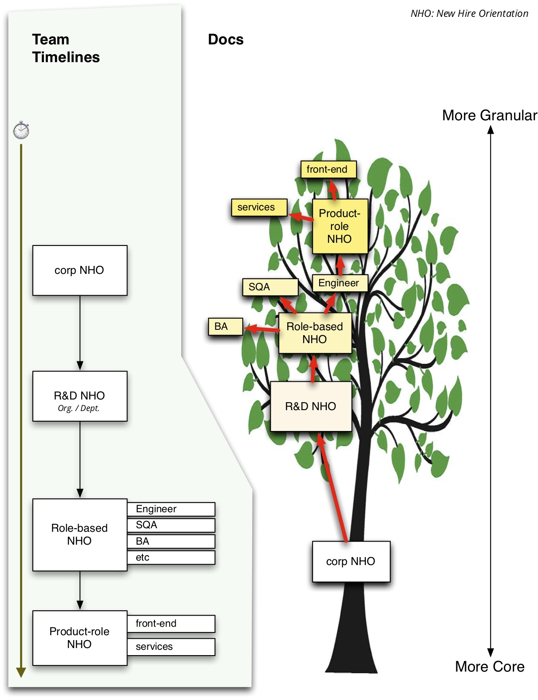
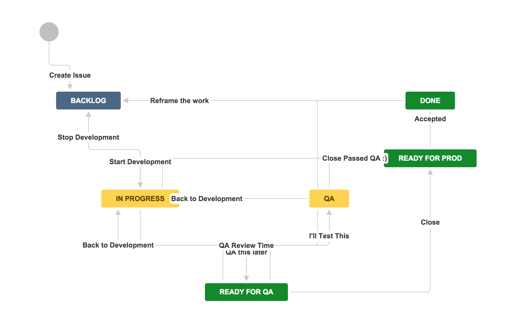

# Onboarding

*Star-board is the direct of the stars, and Port is the direction of the port.* 

## Everything is Virtual. Orient.
There are a few core things to getting rolling correctly in a company – for anyone, you, and me.

The process is generally broken up into pieces of the company's operational structure.  It helps to see this on your own, in case no one presents it this way.

### Corporate

* Our company-wide wiki home is the best switchboard to most things, including each of the depts. wiki pages.  The wiki homes are the place to get 'official' information, such as common brand materials from Marketing, specs and execution plans in the Engineering team's wiki home, sending requests to #eng-support, the new idea pitch board, or the master planning board for active projects..  If you have questions about getting onboard, this page is a great place to post them.
* Glossary

   > Many people have felt that they benefit from reading through the glossary, and asking for more details as needed.   You will receive an invitation to the Even School onboarding, but you can glace at some of the information in advance, if you like.

* d

### Departmental

### Team

* Compile some of the most commonly-used links needed for the team they will join.

### Functional Area

The company's files are located in a set of team drives.  Ask your team about which one is theirs.  We are just finishing the consolidation of company & team files that had been stored in personal drives. If you find or are shared any, ask someone about migrating to the team share.  If you need to use the company logo in a slide set or similar, please use only these official logos.

These drives are also your company backup of files. any working files should be stored there, not locally.  This ensures business continuity in case your computer is lost, and other scenarios.
You will need to install Google File Stream on your computer,

so that you have easy offline access to these files.
You will need a keybase.io account for secure password exchange, and any PII

you talk about/exchange. Then request to join the evenfinancial team.
It is very important that you read these three best-practice pages:

    for drive docs
    wiki usage.  
    When using the tools and software on your respective team and dept, keep in mind this diagram about where to write and store information. 

We will review the content at these three pages around 2 weeks after your start.
Remember also to setup the PTO calendar, for any full or partial days you need to be OOO. Please also add your custom avatar to each of your accounts, to help others quickly identify your edits.
There are many other apps and other things - so if you have ideas to be added to this list (ping me) or the wiki pages (update at will), then thanks for your feedback.

Never hesitate to ping me with any questions on accounts, tooling, and configuration, or grab anyone else around you.