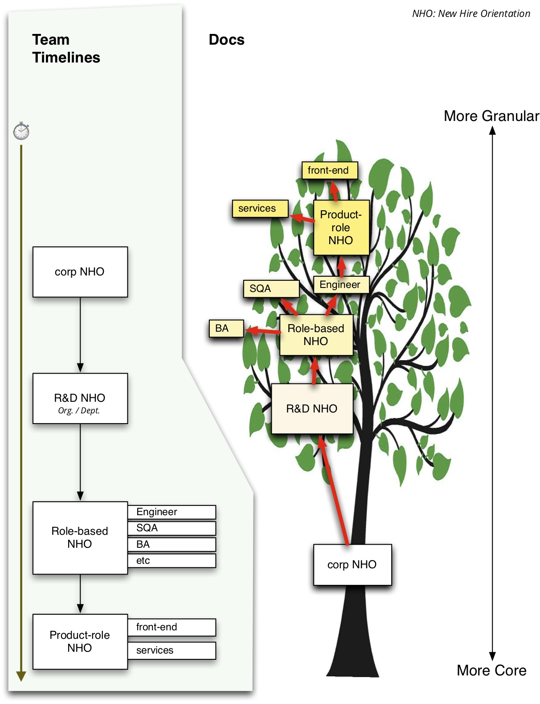

# Onboarding

*Star-board is the direct of the stars, and Port is the direction of the port.* 

## Everything is Virtual. Orient.

There are a few core things to get rolling correctly in a company – for anyone, you, and me.

The process is generally broken up into pieces of the company's operational structure.  It helps to see this on your own, in case no one presents it this way.

## Agile, and Harmony

Across all of the practices and guidance you will learn when onboarding, 'agile' practice will appear as a common tenet.  Practice agility aims for a kind of efficiency.  Since 'efficiency' often gets muddled with multiple meanings, there is another word that perfects fits the aim of agile: "[Achdus](https://dafaleph.com/home/2015/12/1/achdus)".  Achdus is the principle of harmonious interconnetion between all involved things — people, processes, and systems.  

The harmony of _achdus_ respects, *and leverages*, the complex interweaving of the differences inherent for those involved.  We could hardly better-state the aim of designing and evolving agile practices.  Agile practices ask of us to remain sensitive to the nature of things: those we work with, the situations that emerge, the nature of our environment, and the horizons we hold.  

The sensitivity allows us to relax into norms and remain aware for uncommon things that need a measure of attention — as well as when time has shown that we need to adapt and change practices. 

### CAP Theorem in Org Dynamics

A study has shown that, [under time-pressure, people will go against their sense-of-correctness, and socially conform](https://journals.sagepub.com/doi/suppl/10.1177/0956797619867939).

In context, it may mean that speed of workflow can get reduced below a threshold of efficiency that is worse that the ‘wrong answer’.

i.e. if this is a metric toward the way that “IQ is lower in groups”
if so, it could help toward defining ideal group sizes relative to necessary speed.

## Map

### Corporate

* Our company-wide wiki home is the best switchboard to most things, including each of the depts. wiki pages.  The wiki homes are the place to get 'official' information, such as common brand materials from Marketing, specs and execution plans in the Engineering team's wiki home, sending requests to #eng-support, the new idea pitch board, or the Overarching planning board for active projects..  If you have questions about getting onboard, this page is a great place to post them.

* Glossary

   > Many people have felt that they benefit from reading through the glossary, and asking for more details as needed.   You will receive an invitation to the Even School onboarding, but you can glace at some of the information in advance, if you like.

* Remember to setup the PTO calendar, for any full or partial days you need to be OOO, WFH, etc.  
* Please also add your custom avatar to each of your accounts, to help others quickly identify your edits.  Faces are recognized quicker than names, and it strengthens the memory of what they like about you.

🔗 [More details on Corp-level onboarding](onboarding/NHO-corp.md).

### Departmental

* The company's files are located in a set of team drives.  Ask your team about which one is theirs.  
* Some teams will be more or less down the roadmap of consolidating their company & team files - that had been otherwise stored in personal spaces, laptops, etc. If you find or are shared any 'cut off' like that, ask someone about migrating to the team share.  
* These drives are also your means for backup of files. Any working files should be stored there, not locally.  This ensures business continuity in case your computer is lost, we all have to work OOO, etc.
  * You will need to install the tool that does this local filesystem sync, like Google File Stream, on your computer.  This ensures you have easy offline access to these files as they are updated by the rest of the team.
  * I typically underscore that it is very important that to read these three best-practice pages:
     * for drive docs.
     * wiki usage.  
     * Using the right tool. 

         > When using the tools and software on your respective team and dept, keep in mind this diagram about where to write and store information. 

         > Ideally, there we will review the content on these three pages, around 2 weeks after someone's start.

* If you need to use the company logo in a slide set or similar, please use only the official logos, slide templates, etc, that the marketing and PR teams provide.

🔗 [More details on Departmental onboarding](onboarding/NHO-dept.md).

### Team

* Compile some of the most commonly-used links needed for the team they will join.

#### Chat 

There are many cognitive studies on chat systems, and so on. One of the most common tangible anti-patterns of chat is the communication of passwords, and other shared secrets. 

* You will need a secure chat / comms too, based on whether your team handles 'high risk' information.  This can be a tool like keybase.io account, or the company's main chat if it has been secured for sharing such information.  
  * Typically a secure chat is for secure exchange of passwords, any PII, and other information that can constitute a data breach. 
  * If there is only one chat system at the company, ensure that it has sufficient security for transmission of high-risk information.
  * Send secret info via DMs is not enough.  A compromised account will cause a breach.

🔗 [More details on onboarding into a team](onboarding/NHO-team.md).

### Functional Area

* Team-specific tools, work environment, and debugging / research.

🔗 [More details on onboarding into a company's guilds](onboarding/NHO-practice-group.md).

### Errata and Invitation

There are many other apps and other things - so if you have ideas to be added to this list (ping your boss or another leader) or the wiki pages (update at will), then thanks for your feedback.

Never hesitate to reach out with any questions on accounts, tooling, and configuration, or grab anyone else around you.   _Alacrity_

## Onboarding Model

Having said all that, here is a summary model:

### Onboarding
- main HR setup
- Team setup
- Function / Role setup
- Custom setup

### Onboarding types

Each of these will have specifications per team and function.

- Accounts, integrations/cals
- Email lists, groups
- Trainings
- Hardware
- Comms / intros

### Offboarding
- Inverse of the processes
