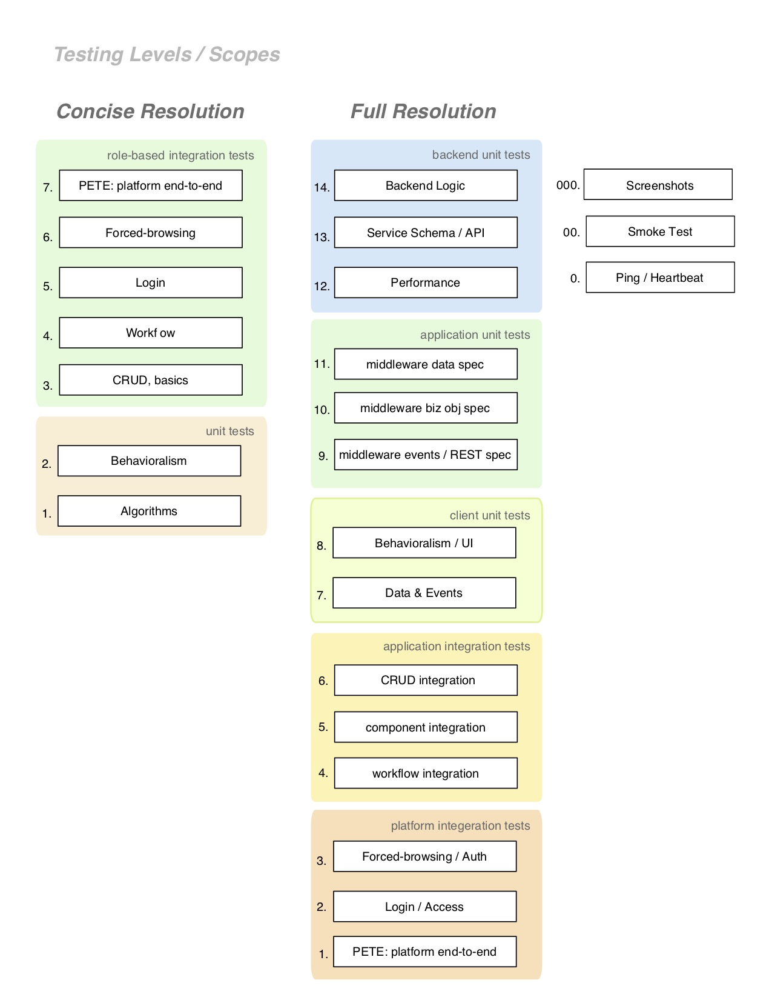

# QA, from manual to automation

## Roadmap

|                | phase 1                                                       | phase 2                                                        | phase 3                                                                                   | phase 4                                                       |
|----------------|---------------------------------------------------------------|----------------------------------------------------------------|-------------------------------------------------------------------------------------------|---------------------------------------------------------------|
| main goal      | manual / exploratory testing. | manual / exploratory testing. | manual / exploratory testing. | manual / exploratory testing.  | manual / exploratory testing. | manual / exploratory testing.                             | manual / exploratory testing. | manual / exploratory testing. |
| secondary goal | Master plan development.                                      | Write BDD feature files, structure and develop common language. | Prioritize testing labels for Continuous Delivery.Refine BDD language; improve coherence. | Automation test creation.                                     |
| schedule dates |                                                               |                                                                |                                                                                           |                                                               |

Our BDD outline, today, is very rough. We have one spreadsheet with many many test cases (and many are effectively duplicate). Then we have some gherkin-style tests written, with ruby-cucumber step definitions behind them. When writing new automation tests, we want to follow the ruby step definitions we have today, so that our in-house engineers have an easier time updating them.

Our aim with the spreadsheet and BDD files we have today:

1. consolidate & de-duplicate the tests
1. organize into groups, by section and component. These lists (should) reflect the same components
	* Live style-guide website
	* current QA sheet (ad-hoc list)
	* Wiki list
	* QA / Validation Portal
1. keep up with testing (exploratory/manual/automated) of sections and components impacted by code changes for ongoing releases
1. write new automation tests / checks by following the consolidate BDD testing outline that we formulate.

### Phase 1

1. Keep up with feature/section testing, for our releases, and then
2. Refining the existing testing outline, e.g. removing old features
adding new sections and record of major features reorganizing it for clarity
developing mobile-specific addenda for each component / section

### Phase 2

1. We will continue the manual evaluation of sections, particularly
those pages and features related to campaigns, and
the release of ongoing improvements.
2. Write and update the tests as gherkin feature files (BDD) develop @labels for appropriate test categories.
develop a common language across feature files.

### Phase 3

1. We will continue the manual evaluation of sections, particularly related to the release of ongoing improvements
2. label tests by priority, toward having a plan for Continuous Deployment
smoke tests campaign points major content / UX ( other levels TBD )

### Phase 4

1. testing features/sections for the releases
a. manually as required / where automation gaps exist
b. appraise the efficacy of automation check coverage;
Refine.
2. writing more automation tests & checks.
a. Our existing feature files

## Kinds of Automated Checks and Tests

On of the most common anti-patterns occurs when separation-of-concerns does not happen. The following chart presents granular separation levels that help to isolate exactly one kind of thing being tested.

This skeleton of automated test-types matrixes with the product feature 'master plan' and its phased roll-out from manual to automation.  Each element of this matrix can receive prioritization, which guides the planification of the overall roadmap.  

## Tags, and Test Scopes

I also think it will help people to elaborate on the kinds of tagging that can happen, and which are related to environments (& an eventual CD process).  This concept will help people understand the movement toward the array of development environments, and how they can be used.

* `@development`
* `@staging`
* `@performance`
* `@UAT`
* `@smoketests`
* `@production`

These names are typical environments in a deployment chain. If we implement a CD (continuous deployment) pipeline, then we can leverage these tags to ensure that all members of the org can participate in the definition of readiness for production. To do that, consider the tests for each environment to be a subset of the tests for the next, such that `development > staging > UAT > production`.  

### Performance Testing

I have ommitted performance and smoketests from this chain because they are not often subsets.  Performance tests are often a specific slice of unit and integration tests, with fixture data that demonstrates the app + infrastructure's ability to handle load.  It is worth mentioning that some companies use a scaled roll-out deployment to handle load testing.  By making the production deploy in-use by more-and-more active users, then one can confirm if it handles load.  'Performance regressions' can halt the further roll-out until a hotfix is applied.

### Smoketest

This term still has varied meaning.  In some cases it means the set of services, endpoints, etc, which must respond in order to confirm that systems run adequately to begin testing the whole platform/app with other tests. 

These tests often get placed in 'ping' services, for health and 'heartbeat' confirmations.  Some will run them before any environments' tests, where integration tests run in that scope.

Some use the term 'smoketest' to mean a subset of tests that confirm minimal system availability, but without and specific definition on that.  This document uses the former meaning.

### Others

* `@business`
* `@WIP`
* `@persona @checking-rate-hunter`
* `@Ticket-1234`
* `@production-adserve`
* `@production-accounts`

Many other patterns of test tagging are used.  Here we will discuss a few examples

"Business" test mirror smoke-tests, but pertaining to parts of the app or system that are critical for the company's revenue.  In many cases, these tests having the highest criticality and get written first.

"WIP" tests have an issue that prevents them from running.  Long-term projects to unify and dedupe, tests that were written as features but without accompanying automation, tests that fail erratically, etc.  These are automation tech debt.

Persona tags can represent which tests have been built for specific users' interaction with the system.

Tests that use a specific Ticket number can help identify which tickets have gone into supporting this feature test.  When multiple tickets are listed, this can indicate when there exist problems in the underlying code implementation, or when the test lacks sufficiently isolated from other layers of testing (see 'Kinds of Automation Checks', above'.  Product teams can also uses these tags to help maintain an orderly backlog of tickets, and associated bugs.

Environment-hyphenated tickets can identify which features depend on specific subsystems, like login, revenue systems, account management, etc. This organization of tests helps to develop subsets for simplifying CD, or for live-rechecking of critical-but-occassional systems.

| | Quality Areas to Test | Where | Tags * | Tooling |
|---|-------|----|----|----|
| 1. | Unit tests, Algorithmic | service, app | @mocked | jasmine, rspec |
| 2. | Unit tests, Behavioral | app | @mocked, @behavioral | jasmine, karma | 3. | Feature scenarios | app, service | @validation, @calculation, @uipermissions | cucumber, capybara, VCR |
| 4. | App Workflow, role-based | app, service? | @business, @uipermissions | cucumber, capybara, VCR |
| 5. | End-to-End, Login, role-based | E2E tool |  @login | cucumber |
| 6. | End-to-End, Platform (PETE) | E2E tool |  @pete | cucumber |
| 7. | End-to-End, role, Security | E2E tool | @security | cucumber |

`*` base set of likely tags, conditional to the specific automated test. Not comprehensive.
