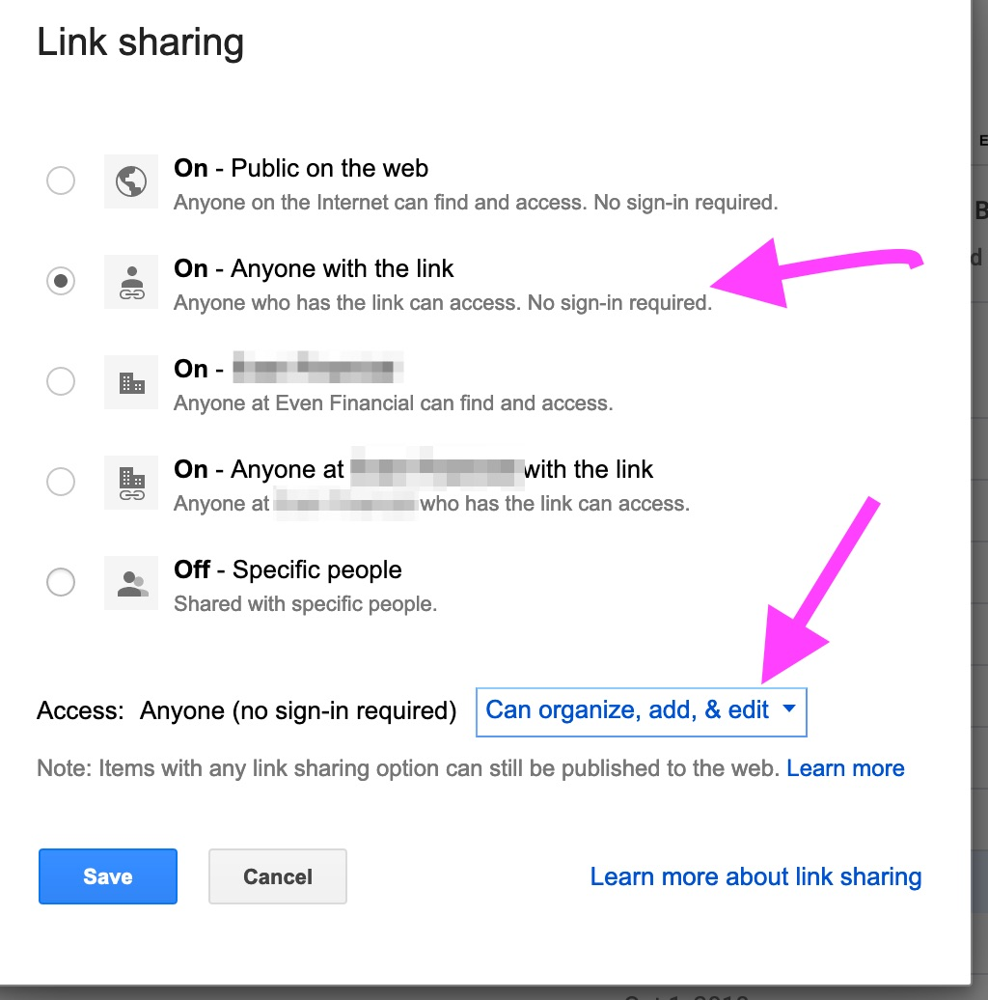

# Security for Accounts

## When to Create a Domain Account

Often, setting up SaaS accounts for team access, or a master admin credential, requires a related email. We avoid using personal email for these situations.

We should also avoid asking for a new email account to be setup for these purposes.

Problem: gmail accounts are 'domain accounts' that have access to cloud, docs, and other SSO account auto-creation.  Now can be effectively logged into many accounts.
Instructions

* Avoid creating domain users for non-people, unless for hard-technical limits.
* Restricted access groups are preferred.
* Make a domain-group that cannot access common resources: drives, cals, SSO to apps, etc.
* Configure it to receive email from "the whole web".  (this wording may change over time)
* Add any other team members to the group.  Add you boss and anyone else as admins.

## Parties outside of the Domain

As is the case with groups (emails) that can receive info outside the domain, sometimes folders and chats need to be coordinated as well.

### 🗄 File Exchanges (Non-PII)

This is a folder in a personal drive. You cannot do this with Team Drives. It’s a way to 'swap' files through the account of someone (on the team that needs this), and get those files into whatever is the preferred team space.

### 💬 Chat

Similarly, Hangouts and most chat systems can be open-invite.
