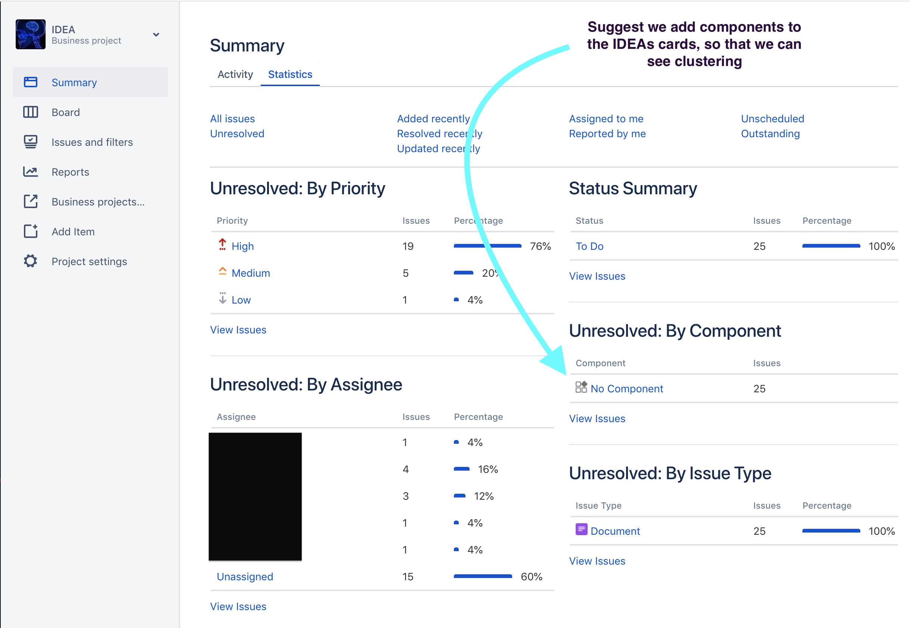

# Ticketing patterns

Write in phases - edit and update.

Live with uncomfortable choice of words/terms, so that it forces all to edit later and get it correct.

Always use a components field for each card.  The components field indicates a specific list of terms that represent the parts. of this application that have business value.  (This is part of what is called the 'Business Ontology')

## Types

The following concept of stories, tasks, and bugs helps to define common work in software projects. A team should always talk about limitations or issues that this scheme represents to their type of work.  

Different types are common with Customer Support, IT, HR, Design / Creative, Platform / infrastructure, Data Science, Sales / BD, Reporting, Data Science, Facilities, and others.  Regardless, it is important to be on the watch for the emergence of new Types within a team, or the company at-large. The same goes for the infrequency of a card Type.  These changes can represent the evolution of a business, an industry, or Work.

### Stories
Stories are anything that is a user-facing change or feature. This includes config changes that affects the UX.  

### Tasks
Tasks are any change that is not user-facing. We leave-out changes to performance, and many other semantic arguments.  e.g. a new widget display format may be a Story if it will directly change the format for a user — but a task if it will be part of a library that impacts a user in a subsequent ticket. 

### Bugs
Bugs make a change to anything that is not as originally specified.  This does not include changes that were not specified ideally or correctly during planning.  The purpose of a bug ticket it to notate that there was a regression or incorrect release - but it is not meant to be a penalty to individuals, as often the team collectively owns a relationship to quality. 

### Priority

Priorities that emerge naturally are often best for a team.  When changing the kinds of priorities, be sure not to impact other teams using the same SaaS within the company.

Often some form of 'this needs to be worked until solved, world-on-fire' priority will exist.  "Fuego", etc.  Be sure to allow the rarely, since the psychological pressure of them will still with teams long-after. Similarly, a 'sub-fuego' priority is often important to differentiate from other recently-prioritized work from Grooming sessions.

One pattern is to make the lowest priority the default.  This forces ticket creators to consider the actual importance level of their request, and as needed to work with team leads. 

Remember that the prioritization level of the backlog is often irrelevant once a ticket has been elected for the sprint, or approved to be 'accelerated' up the agile kanban backlog. Regardless, the 'fuego' and 'sub-fuego' steam of work should always lead to consideration of whether this is an 'andon cord' situation that trumps prior planification.


## Boards

As you scale, consider that you may benefit from having separate boards for each kind of work happening.  With that, different workflows / columns can help ensure that things are clear to all that work (and on) with the team.  I've seen it increase velocity in perhaps every scenario.

### Innovation

I have found it highly value to implement an 'ideas inbox' as a board.

This serves a few value purposes

* People can feel satisfaction knowing they have contributed to a board-visibility ideas queue.
* Meritocracies can be explored for all kinds of contributions — not just origination.  Some people's contributions are editorial, and other kinds of support (which shows up in logs).
* Fairness can be exercised, if there is a need to make sure that new ideas are not being given visibility.
* Organization can be introduced, beating static lists and other manual-curation methods.
* Culture of 'raise your hand' or 'see something, say something'.  Encourage people to speak-up, have ideas, communicate, prioritize, and learn.



## Estimation

### Some Queries

```
"Story Points" > 1.0 AND "Story Points" < 2 OR "Story Points" > 2.0 AND "Story Points" < 3 OR "Story Points" > 3.0 AND "Story Points" < 5 OR "Story Points" > 5.0 AND "Story Points" < 8 OR "Story Points" > 8.0 AND "Story Points" < 13 OR "Story Points" > 13.0 AND "Story Points" < 21 ORDER BY lastViewed DESC
```

### Story Points as a Team

Generally, new cards are story pointed by the agile team.  That is to say

* a grooming session involves all people relevant to understanding the build and testing of a feature or task
  * this avoids missing criteria that may require more work up-front.
  * this avoids a bunch of new bugs and additions right before the release of the project.
* grooming is done on a cycle like a sprint, any other interval, or as-needed
* grooming looks to give story points to any number of cards, until enough can be worked on between now and the next time that grooming will be done
* groomed cards can be move to the top of backlog, or whatever metaphor is used for 'ready to work by anyone one the team'

### Story Points by one Person

Though this is discouraged, it happens sometimes.  We should think about doing this only when:

1. When work is started on something before there was time to groom it as a team. This is the most common case.
1. Adding story points retroactively, which is common when getting into the habit of story pointing (as a team/company), and you miss some.

> Add `.01` to the story points, to indicate that it was done by a single person.  E.G. `2.01`

#### Adding .01 serves two purposes

1. It reminds others on the team why a card has story points, if they weren't involved
1. When totaling velocity, these will add up and the velocity will look like `214.17`, which tells you that `17` cards were estimated by only a single person.  This is an error factor in using historical data for projections

### 📐 Story Points

I argue against estimating *time* for tickets.  After many years, I've seen the teams that estimate time do worse that teams that estimate risk.

💡 Time estimations are a guess, but are treated as commitments.  That is a system that people will 'game'.  Break the bad habits by developed in-house or per-team guesses of complexity.  Complexity 'steps' are much more intuitive and easier to guess.

You will need to choose a counting system, and a socialize a rubric for modeling risk. 

The first is the easiest.  Most seem to choose a fibonacci scale, or a binary scale. The important element seems like the gaps between the numbers.... or at least, the rubric and the gaps need to relate to each other.  'Fibs' make it hard for most people to keep counting higher.   i.e. 3,5,8,13,21,34,55,89 is harder than 8,16,32,64,128, let along 4,5,6,7,8,9.  Let's see what this means, with a complexity-based rubric.

As work specs (tickets) get bigger, the complexity increases.  Complexity implicitly means that the task at focus can be affected by other parts of the system, or even other externalities.  These go so far as the proverbial 'unknown unknowns'.  Most people are bad at guessing these, and the problem only has minor solution given more experience and audit-mindset. 

##### E Pluribus Unum

Most teams begin by considering their **smallest type of change**.  Usually a task that happens often and cannot be automated.  Finding this 'base unit' challenges people in their assumptions about automation, and minimum thresholds for coordinating work tasks.  Over the long-term, you will see backlog grooming and estimation meetings debate if some task is 'too small' to be counted as '1 point'.  My principle here is to avoid having more than a couple of these each week for a typical engineer/developer.  If more than that, something wrong — such as bad QA (too many small bugs being released into production), or developers essentially acting as customer-service or account management.

##### Counting Up

Deciding if a task is the next largest number [of points] is not just about doing "more 1s" but about finding something that is conceptually more complex than the previous number.  In principle, this is based on externalities — like non-stdlib code libraries, code frameworks, APIs, and more, even sometimes when there is enough human comms in the loop of the work.

General, people who have worked in a given area (backend, fronend, devop, data eng, data sci, etc) have the experience to guess at when something involves enough complexity that it could be counted as the next higher number.  'Sr' and 'Lead' level staff, especially. 

One way to handle the complexity rubric is to add a point for each kind/type of thing involved, and another for each that is the first time the pattern will be implemented. 

Whatever rubric is chosen, socialize it, and stick to it for several estimation meetings, to give it a chance.  From there, retrospective and decide how to revise it.  

##### Backlog Caps

Aim to have a limit on the largest point-size card that can be put on the backlog.  

This principle comes from the reality that many tasks are dleayed excessibely because they were not sized correctly in the first place.  For many teams using a fib scale, 5 or 8pt cards seem to be the largest.  You will naturally get a sense of the right size, based on what are typical point-sizes for cards at each of the stages: chartering > storymapping > backlog.   

Don't be afraid to break-up a ticket after it's been started, if the team finds it was not well understood.  It can sometimes help to 'push through' and learn from the mistake, but more often than not, the poor scoping will cause delays that will frustrate everyone.  A stitch in time saves nine.

#### Feature Projects vs. Backlog

Occasionally the question arises whether story points have the same meaning for cards in a feature release project, vs. cards in an unstructured backlog.  In six years of being a core stakeholder in backlogs estimated with a fibonacci risk scale, I have never seen a variance.

Teams should be discouraged from not-estimating cards, or conceiving of inconsistent story point meanings.

* Software Engineering risk types
* [UX risk types](http://uxmag.com/articles/quantifying-usability)

### Variations between kinds of work

Card types are an important differentiation to develop on a team. It is common that a team develops its own card types, in accordance with the kind of work that occurs.  It's often best to let these types emerge, rather than forcing them on a team. Until team members see the value of using types, their under-appreciation for the solution may become source of distraction.

The most common differentiation is between **Bugs**, and non-bugs (**Tasks**).  This goes for engineering teams, and looking at other teams we will quickly see other low-hanging norms.

> The reason to differentiate types of work resides in the validation criteria, and thereby the specification criteria and context. 

This argues that having different cards requires significantly different set of criteria to be evaluated about the work.  In the case of a bug, a number of reproduction criteria are required, as well as context of the environment.  All of this may reside in common fields, but doing so forces one to _templatize_ a free text area, like the description.  

This can lead to data entry errors, and completeness or consistency issues.  Using dedicated fields for important card criteria enables use native validations of the ticketing system, and native reporting — e.g. JQL filter query notifications and dashboards.

Likewise, Product teams may find use in cards for user research, A/B experiments, mocks or similar, and types of QA.  Strategy teams may have cards for cohort analysis, segmentation models, compliance criteria, etc.  Client Services teams may use may types within the onboarding stream, and have types for broadening usage, gathering success criteria, etc. 

### Keeping things Assigned

Unassigned cards are often lost. This impacts everyone culturally, and it throws off velocity.  

### The Subtask Trap

Ideal practice for a state like QA, where someone else may work on it for a moment, is that the card remains assigned to the developer, and a subtask is created for the person that will QA it.  Alternatively, using types of cards in each teams' queue, a Product team's QA card may be linked to the development card. 

1. This is also more ideal for point estimates with each team, and velocity correctness.  
2. This avoids the pattern of a development card having `X` subtasks created each time, for all of the related pieces of work and validation done by other members of the agile team. 

When 'groups' of subtasks are created, it tends to imply that the card should have a roll-up total of story points from all the subtasks.  This leads to inflation that has no utility: story points can be summed in other places. 

It is probably best to use subtasks only when no measure is made of the work being done by those assigned the tasks.  Some patterns includes when business units are small and moving fast with a small team, or when the subtasks are a form of to-do list... which for some reason may be better than formatting a bullet-list in the card's body.  

> Be cautious not to add more to-do after starting work on the card!

